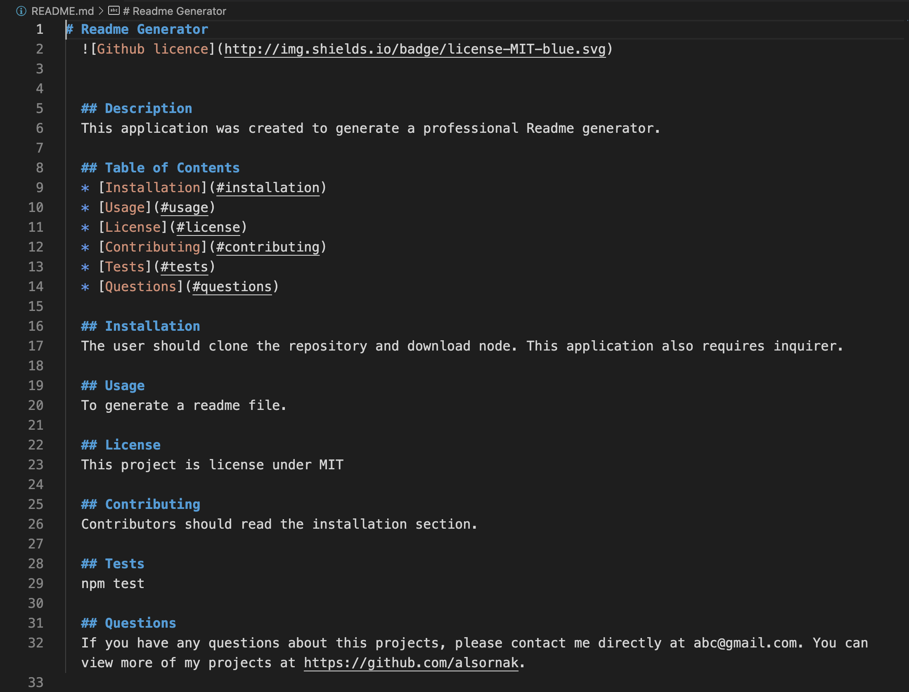

# Readme Generator
  

  
  ## Description 
  This application was created to generate a professional Readme gnerator.

  ## Table of Contents
  * [Installation](#installation)
  * [Usage](#usage)
  * [License](#license)
  * [Contributing](#contributing)
  * [Tests](#tests)
  * [Questions](#questions)
  
  ## Installation 
  The user should clone the repository and download node. This application also requires inquirer.

  ## Usage 
  To generate a readme file.

  ## Walkthrough Video
  Professional Generator Walkthrough https://watch.screencastify.com/v/gWV5cj5uL0sJ7NOninKW

  ## Screenshot
  

  ## License 
  This project is license under MIT

  ## Contributing 
  Contributors should read the installation section.

  ## Tests
  npm test

  ## Questions
  If you have any questions about this projects, please contact me directly at abc@gmail.com. You can view more of my projects at https://github.com/alsornak.
